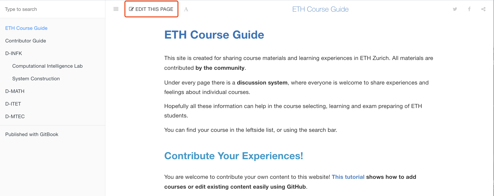
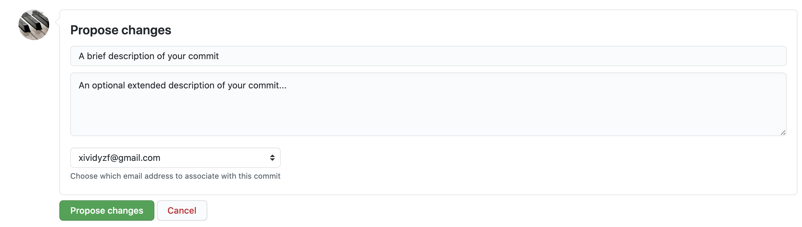
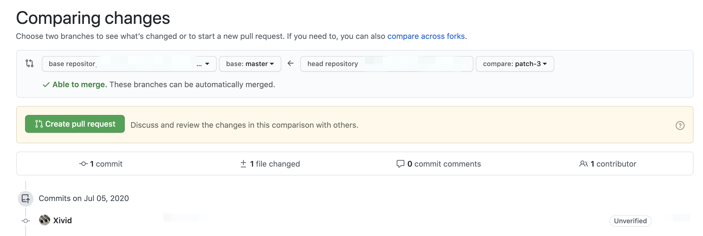
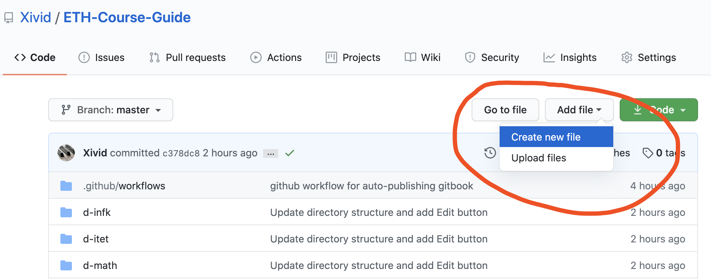
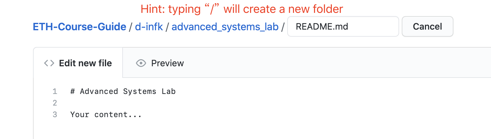

# Contributor Guide

If you would like to contribute your content, the simplest way is to use the GitHub website or desktop client. You will need a GitHub account to do so. ([GitHub](https://github.com) is the most popular platform for version control and project collaboration. It works upon the famous version control system [git](https://git-scm.com).)

In this guide, we demonstrate how to add a course page or edit a existing page using the GitHub website.

## Using the GitHub Website

### Edit an existing page

At the top of every page in this site, there is a button called "EDIT THIS PAGE", as shown in the screenshot below. You may need to scroll up to see this top bar.



Clicking this button will lead you to the GitHub editor for this page. You may be asked to sign up and fork this repository before entering the editor. Markdown syntax is required for editing the file. After your editing is done, you will need to commit your changes. Please compose a description for your commit before committing, as exemplified below:



After clicking "Propose changes", click "Create pull request" on the new page, so that the maintainers will be notified, and review and merge your changes into the website.



### Create a page for a new course

What if your course is not included in this website yet? Easy. Just create the file for that course from [the repository page](https://github.com/Xivid/ETH-Course-Guide).



Click "Add file"->"Create new file", enter the correct path and name following the directory structure [described below](#directory-structure), and everything next is just the same as the steps above.



### Upload files for a course

To upload files (e.g. your PDF cheatsheet) for a course, goto the corresponding folder in [the GitHub repository](https://github.com/Xivid/ETH-Course-Guide), click "Add file"->"Upload files". Follow the instructions to upload your files, and add a link to the file in the course's `README.md`. You can find the link to the file by clicking your uploaded file, and copying the link address of the "Raw" button on that page.

### Conclusion

The GitHub website only offers limited functionality for editing and uploading. Alternatively, if you are familiar with git commandlines, we do encourage you to <iframe src="https://ghbtns.com/github-btn.html?user=Xivid&repo=ETH-Course-Guide&type=fork&count=false" frameborder="0" scrolling="0" width="60" height="20" title="GitHub"></iframe> this repository from GitHub, make changes in your local repository, and send us pull requests!

## Directory Structure

When contributing, please do follow the directory structure of the repository. The courses are organised by department first, then by course name. Inside a course's folder, `README.md` includes the content shown at the course's webpage. All assets (images, pdfs, etc.) referenced by that webpage are either put in the same folder, or linked from outside the repository (e.g. your file sharing link).

For example, to contribute your content for a course, simply modify the Markdown (.md) file of that course, located in `[department]/[course-name]/README.md`.  If the course is not yet existent on this website, please create the Markdown file using the course's full name, put it in the directory of the professor's affiliated department, and link it by adding an entry in `SUMMARY.md`; for example, for Algorithms Lab in the Department of Computer Science, create a folder `algorithms-lab` in `d-infk/`, put your content in `d-infk/algorithms-lab/README.md`, then add one line in `SUMMARY.md` at the root folder:

```pre
    * [Algorithms Lab](d-infk/algorithms-lab/README.md)
```

## Rules

We encourage contributing contents of the following forms:

- Course take-or-not suggestions
- Publicly available e-textbooks
- Self-composed answers for assignments and past exam papers
- Exam preparation materials
- Exam cheatsheets

Contents such as the following are inappropriate for uploading:

- Pirated/paid copies of books
- Lecture notes or slides released in official course websites
- Any software or code of which the contributor do not own copyright 
- Any content deemed inappropriate by the course staff of a particular course
